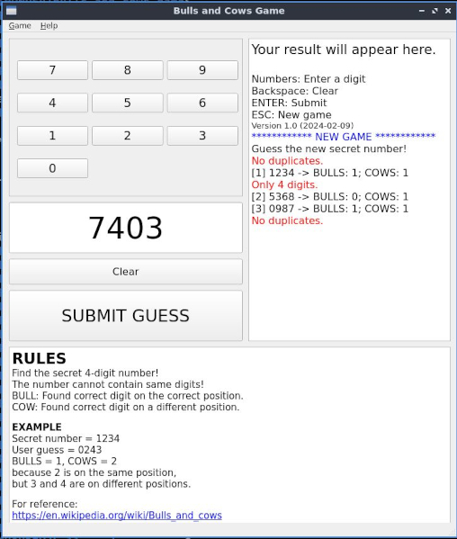

# BULLS AND COWS GAME

<!-- Badges Section -->
[](https://github.com/StrayFeral/bulls_and_cows_game/releases/latest)




Terminal and PyQt implementations of the classic "Bulls and Cows" game (yes, that same old game we all played in high-school with pen and paper).

## DEPENDENCIES

- Python 3 (any version)
- `python3-pyqt6` - required ONLY for the GUI version

## PACKAGES

There are two packages available for download:

- `bulls-and-cows-game_1.0-1_all.deb` - Terminal version
- `bulls-and-cows-game-qt_1.0-1_all.deb` - Graphical QT6 version

## INSTALLATION (DEBIAN/UBUNTU/ETC)

1. Download the latest DEB packages from the [RELEASES PAGE](https://github.com/StrayFeral/bulls_and_cows_game/releases)
2. Install. You could use apt or any package manager of your choice  

```bash
apt install ./bulls-and-cows-game_1.0-1_all.deb
apt install ./bulls-and-cows-game-qt_1.0-1_all.deb
```
## RUNNING

```bash
# Run the terminal version:
bulls-and-cows-game

# Run the GUI version:
bulls-and-cows-game-qt
```

> [!TIP]
> You could run the GUI version from your linux Games menu.

> [!TIP]
> Man pages are available for both versions of the game.

## INSTALLATION FROM SOURCE

For the terminal only version you only need to download file
`bulls_and_cows_game.py`.  

The GUI version will require the other 3 Python files:
- `bulls_and_cows_game_qt.py`
- `game_layout.py`
- `help_about.py`

> [!TIP]
> If you install the game from source, don't forget to install the dependency package `python3-pyqt6`!

### RUN THE GAME FROM SOURCE

```bash
# Terminal version:
./bulls_and_cows_game.py

# GUI version:
./bulls_and_cows_game_qt.py
```

